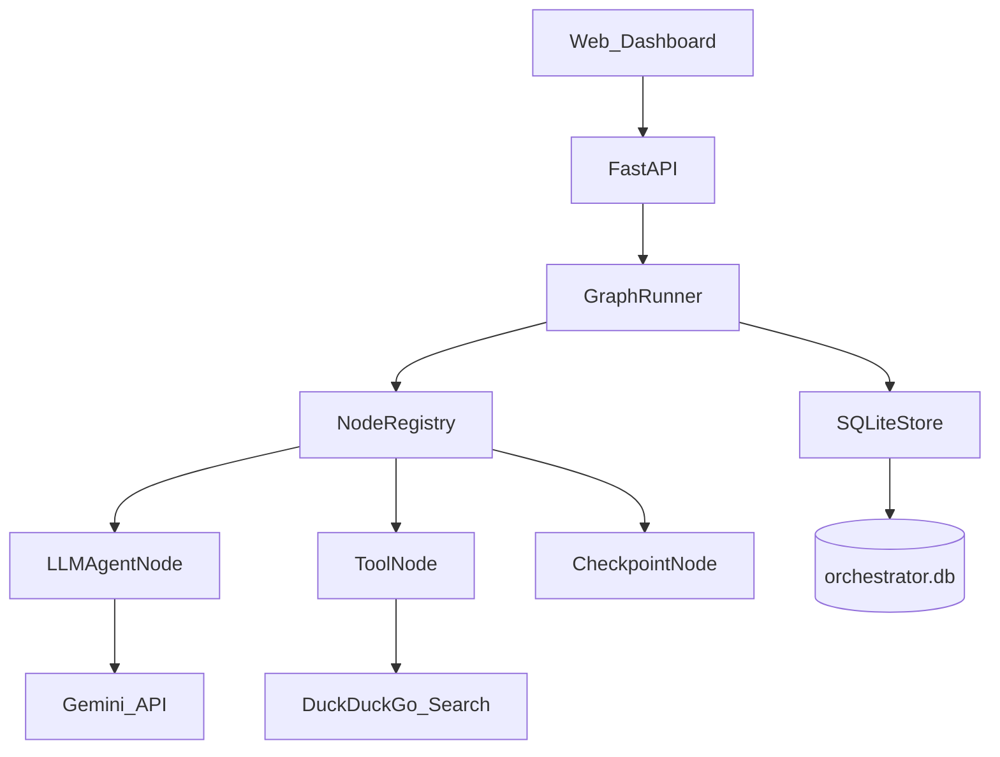
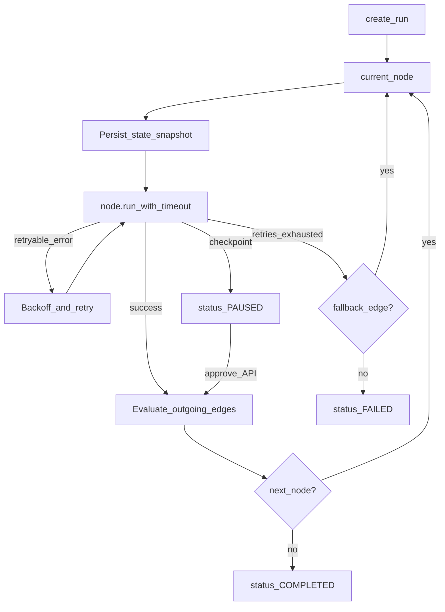
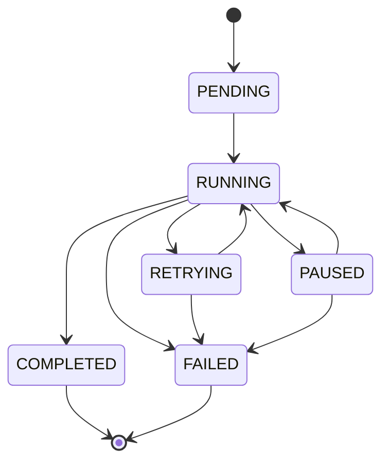
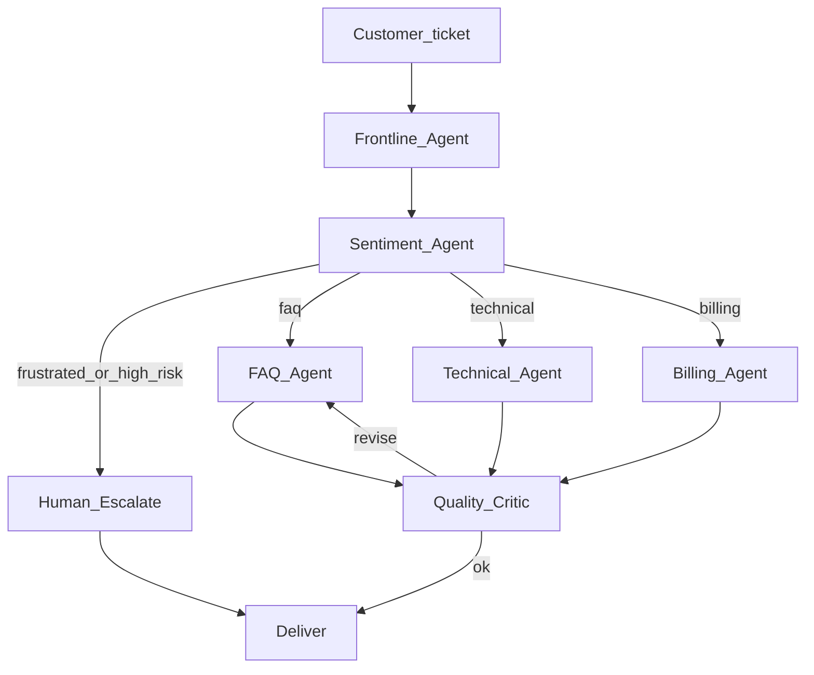
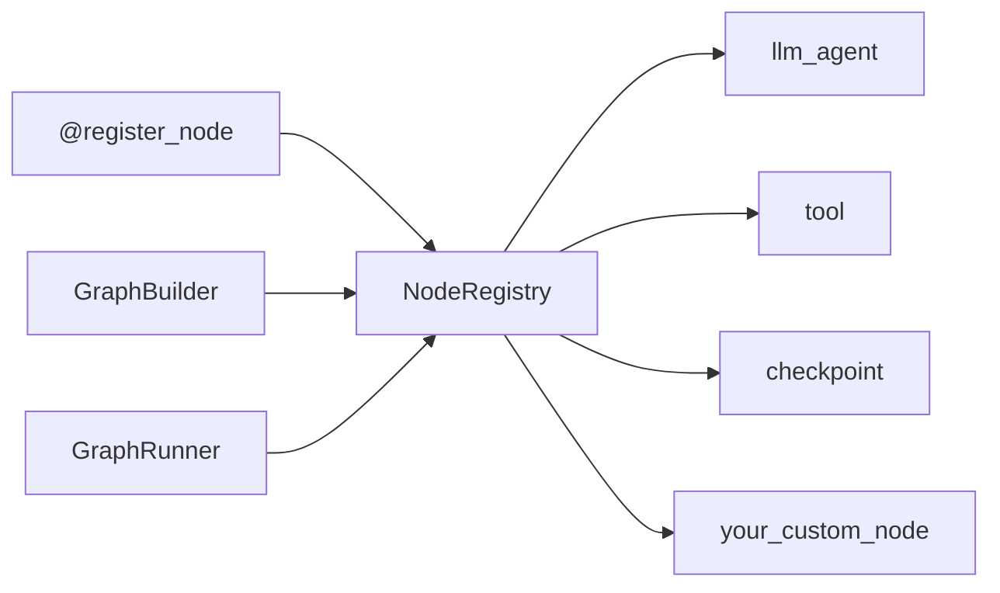

# Agent Orchestrator

A lightweight **graph-based multi-agent orchestration framework** with explicit state, retries, timeouts, human-in-the-loop checkpoints, crash-resumable runs, and a plugin registry for node types. It does not depend on LangGraph or CrewAI.

Built as an **SDE-2 / SDE-3 portfolio project**: the engine is the product; Gemini powers agent nodes; a research-and-report pipeline proves the abstraction end-to-end — including a dashboard that shows agents collaborating.

---

## Features

- **Graph engine** — nodes + edges as data; conditional branches and parallel fan-out
- **Strict run state machine** — illegal transitions are rejected loudly
- **Per-node retry / timeout** — fixed or exponential backoff; retryable vs non-retryable errors; optional fallback edges
- **Checkpointing** — full state snapshots in SQLite before/after every node; resume after crash
- **Adaptive human-in-the-loop** — good outputs deliver automatically; low-scoring outputs auto-revise and pause for approve / reject / revision feedback only after the revision budget is exhausted
- **Fixer recovery agent** — after normal retries fail, a dedicated agent can repair recoverable node failures and return execution to the graph
- **Plugin architecture** — `@register_node("…")` without touching the runner
- **Observability** — structured traces + web dashboard with live progress, expandable agent reasoning and intermediate results, sources, and rendered final output
- **Two workflow demos** — cited research reports and policy-aware customer-support ticket resolution

---

## Architecture



### How a run executes



---

## Run state machine

Illegal transitions raise `IllegalStateTransition` (e.g. `COMPLETED → RUNNING` is rejected).



---

## Reference pipelines

### 1. Research report
Topic → Knowledge lookup → Researcher → Web Search → Writer → Source guard → Critic.

- Critic score **≥ 7**: deliver automatically
- Critic score **< 7**: revise automatically, up to three times
- Still below threshold: pause for human approval or revision feedback
- Exhausted node retries can invoke the **Fixer agent** before the run fails

### 2. Customer Support Resolution Network
Ticket → Frontline (intent) → Sentiment → route to **FAQ / Technical / Billing** specialists → Quality critic → Deliver. If the customer is frustrated or high-risk, **escalate to a human checkpoint** instead.



After login, choose **Research report** or **Customer support ticket** from the workflow picker. The selected workflow then opens its tailored chat composer; both workflows run on the same orchestration engine.


---

## Quick start

### 1. Setup

```bash
python -m venv .venv

# Windows
.venv\Scripts\activate

# macOS / Linux
source .venv/bin/activate

pip install -e ".[dev]"

# Windows
copy .env.example .env

# macOS / Linux
cp .env.example .env
```

Edit `.env`:

```env
GEMINI_API_KEY=your_key_here
GEMINI_MODEL=gemini-flash-lite-latest
```

> Use a current Gemini model. Older IDs like `gemini-2.0-flash` / `gemini-2.5-flash-lite` may return `404` or `429` for new free-tier keys.

### 2. Run locally

```bash
uvicorn agent_orchestrator.api.app:app --reload --host 0.0.0.0 --port 8000
```

Open **http://localhost:8000** (not `0.0.0.0` in the browser).

API docs: **http://localhost:8000/docs**

### 3. Tests

```bash
pytest -q
```

### 4. Docker deploy

```bash
# PowerShell
$env:GEMINI_API_KEY="your_key_here"
docker compose up --build
```

App: **http://localhost:8000** · Health: **http://localhost:8000/api/health**

Persist the `orchestrator_data` volume so runs survive restarts. Same image works on Render / Railway / any container host.

---

## Dashboard (what you demo)

- **Workflow-first landing page** — select Research Report or Customer Support before entering a prompt
- **Chat-style execution view** — the user's prompt appears first, followed by live progress and the final answer
- **Right-side agent rail** — expand any agent card to inspect its reasoning and intermediate result; handoffs show which agent received the work next
- **Collapsible Resources panel** — web sources remain available without crowding the answer
- **Human review controls** — approve, reject, or request a revision with written feedback when a run pauses
- **Run history and durability** — reopen previous runs and resume recoverable interrupted work

When a run is **PAUSED**, the review UI shows the critic score, feedback, and draft preview before the user decides.

---

## Auth, rate limits & cache (public deploy)

For a **public** URL you should protect Gemini quota:

| Env var | Purpose |
|---------|---------|
| `APP_PASSWORD` | Demo login password (required for public) |
| `API_KEY` | Optional `X-API-Key` / Bearer for scripts |
| `SESSION_SECRET` | Signs session cookies — use a long random string |
| `COOKIE_SECURE` | `true` when the site is on HTTPS |

**Behavior**
- If `APP_PASSWORD` is set → `/` redirects to `/login`; API routes need session cookie or `X-API-Key`
- If `APP_PASSWORD` is empty → open access (local only)

**Rate limits** (per IP)
- Start run: **5 / hour**
- Login: **10 / minute**
- Approve / resume: **30 / minute**
- General reads: up to **120 / minute**

**Caches**
- Graph metadata: 5 minutes
- Web search results (same query): 10 minutes
- Health payload: 10 seconds

```env
APP_PASSWORD=your-demo-password
SESSION_SECRET=some-long-random-value
API_KEY=optional-script-key
COOKIE_SECURE=true
```

---

## API

| Method | Path | Purpose |
|--------|------|---------|
| `POST` | `/api/runs` | Start a run (`Idempotency-Key` header optional; replays return the same `run_id`) |
| `GET` | `/api/runs` | List recent runs |
| `GET` | `/api/runs/{id}` | Run status + state |
| `GET` | `/api/runs/{id}/trace` | Execution trace |
| `POST` | `/api/runs/{id}/approve` | HITL approve / reject |
| `POST` | `/api/runs/{id}/resume` | Resume after crash / pause |
| `GET` | `/api/metrics` | Run counts, failure rate, HITL wait stats |
| `GET` | `/api/graphs/research_report` | Graph metadata |
| `GET` | `/api/health` | Health check |

**Idempotency:** send `Idempotency-Key: <unique-string>` (or `idempotency_key` in JSON). Same key + same body → same run (`idempotent_replay: true`). Same key + different body → `409`. Zendesk `start-run` defaults the key to `zendesk:<ticket_id>` so double-clicks don’t create duplicate runs.

---

## Plugin architecture

New node types register without changing the core runner:

```python
from agent_orchestrator.core.registry import register_node
from agent_orchestrator.core.state import State

@register_node("my_tool")
class MyToolNode:
    def __init__(self, name, config, retry_policy=None):
        self.name = name
        self.config = config
        self.retry_policy = retry_policy

    async def run(self, state: State) -> State:
        state.set("result", "done")
        return state
```

Then reference `"my_tool"` in a `GraphBuilder`.



---

## Project layout

```
agent-orchestrator/
├── src/agent_orchestrator/
│   ├── core/             # graph, state, runner, registry, policies
│   ├── persistence/      # SQLite store (runs, traces, snapshots)
│   ├── nodes/            # llm_agent, tool, checkpoint
│   ├── llm/              # Gemini client
│   ├── examples/         # research and support workflow definitions
│   ├── api/              # FastAPI app + routes
│   └── trace_viewer/     # dashboard static assets
├── tests/
├── Dockerfile
├── docker-compose.yml
├── pyproject.toml
├── .env.example
└── README.md
```

---

## Interview demo script

1. Choose **Research report** or **Customer support ticket** on the workflow landing page.
2. Enter a concrete topic or ticket and start the run.
3. Follow live progress, then expand cards in the **Agents** rail to show reasoning, intermediate results, and handoffs.
4. Open **Resources** to inspect the cited web sources.
5. For a low-scoring run, show automatic revisions followed by the human checkpoint; request a revision with feedback or approve the draft.
6. Stop and restart the server during a run, then resume from the persisted checkpoint.
7. Point at `@register_node`, the Fixer recovery path, and the legal transition table in `core/state.py`.

### Talking points

- **State machine:** illegal transitions raise; completed/failed are terminal.
- **Selective retry:** timeouts / rate limits retry; validation errors do not.
- **Durability:** full state snapshots, not just a cursor flag — crash resume is exact.
- **Plugins:** decorator registry keeps the core closed for modification.
- **At scale:** swap SQLite for Postgres / Temporal; move the runner behind a task queue.

---

## Resume one-liner

> Built a graph-based multi-agent orchestrator with durable checkpoints, selective retries, adaptive human review, Fixer-agent recovery, and Gemini-powered research and customer-support workflows with a live collaboration dashboard.

---

## License

MIT — use freely in portfolios and interviews.
