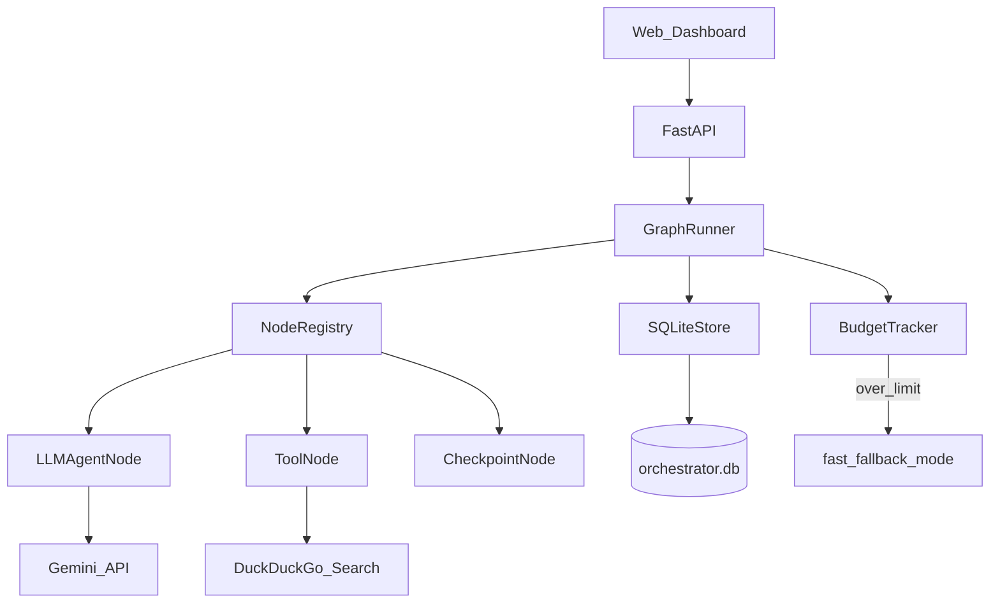
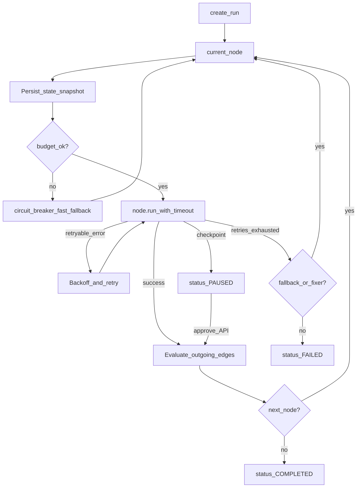
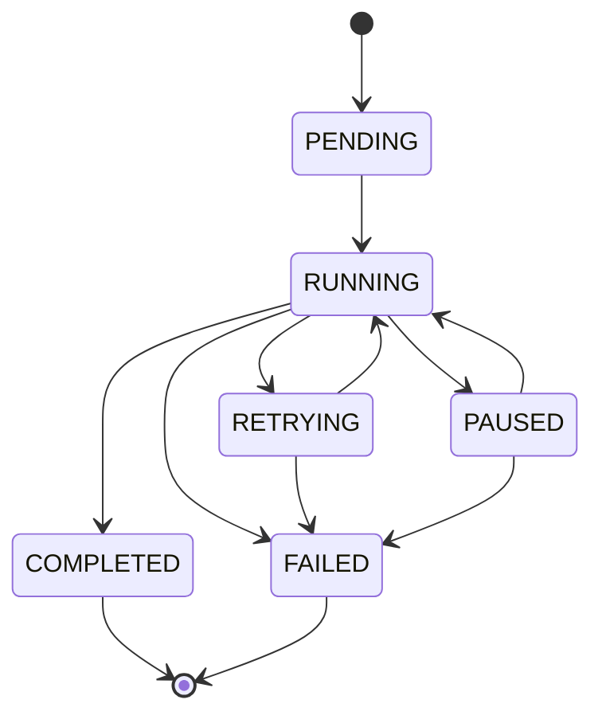
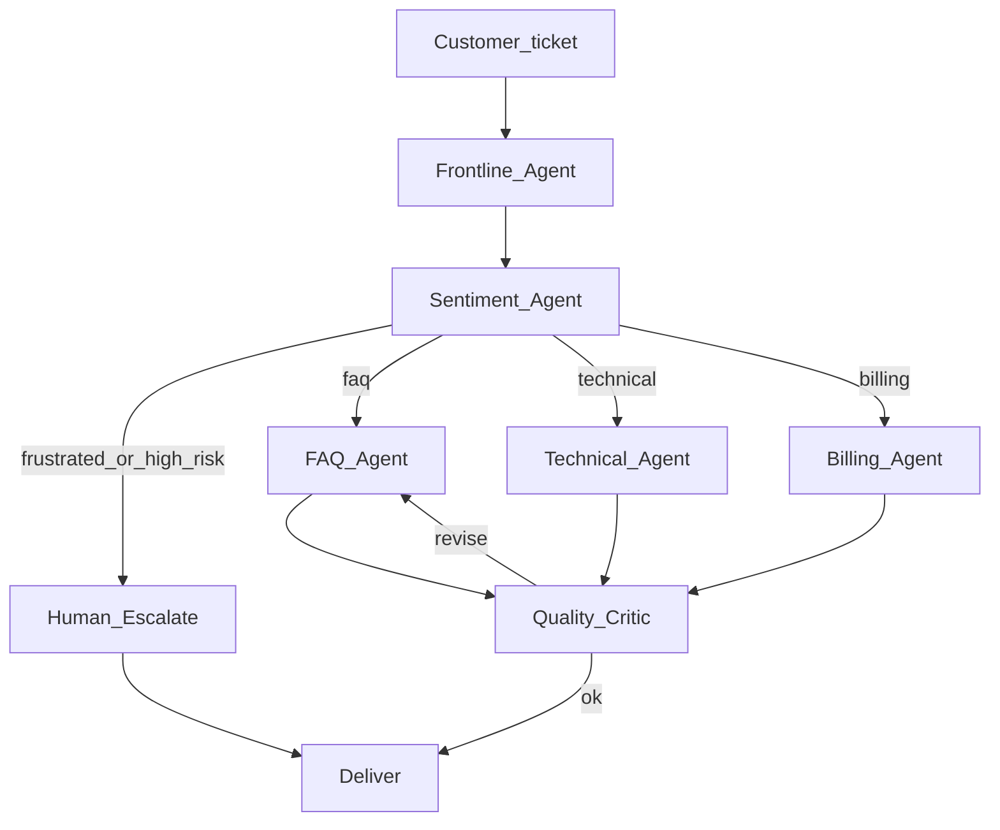
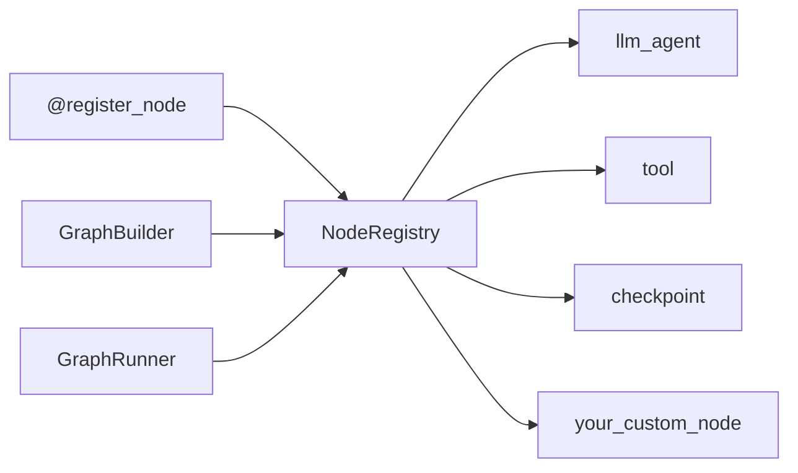

# Agent Orchestrator

A lightweight **graph-based multi-agent orchestration framework** with explicit state, retries, timeouts, human-in-the-loop checkpoints, crash-resumable runs, and a plugin registry for node types. It does not depend on LangGraph or CrewAI.

Built as an **SDE-2 / SDE-3 portfolio project**: the engine is the product; Gemini powers agent nodes; research and support pipelines prove the abstraction end-to-end — including a dashboard that shows agents collaborating under **token budgets**, **autonomous planning**, and **circuit-breaker fallbacks**.

---

## Features

- **Graph engine** — nodes + edges as data; conditional branches and parallel fan-out
- **Strict run state machine** — illegal transitions are rejected loudly
- **Per-node retry / timeout** — fixed or exponential backoff; retryable vs non-retryable errors; optional fallback edges
- **Autonomous planning** — research runs start with a planner that chooses a fast path vs an agentic path from the topic and remaining budget
- **Bounded ReAct researcher** — tool-using research loop with a hard cap on tool calls; falls back to single-shot when budget is tight
- **Per-run token & latency budgets** — soft planner caps (~80%) and hard limits; overspend trips a **circuit breaker** into `fast_fallback` instead of hanging forever
- **Workflow config + UI presets** — deep-merge overrides (`config_override`) and presets like `deep_research` / `force_human_review`
- **Checkpointing** — full state snapshots in SQLite before/after every node; resume after crash
- **Adaptive human-in-the-loop** — good outputs deliver automatically; low-scoring outputs can auto-revise (when debate is on) then pause for approve / reject / revision feedback
- **Fixer recovery agent** — after normal retries fail, a dedicated agent can repair recoverable node failures and return execution to the graph
- **Cost & path telemetry** — live token bar, estimated USD cost, latency, and fast vs agentic path badge in the dashboard
- **Plugin architecture** — `@register_node("…")` without touching the runner
- **Observability** — structured traces + web dashboard with live progress, expandable agent reasoning, sources, and rendered final output
- **Two workflow demos** — cited research reports and policy-aware customer-support ticket resolution

---

## Architecture



### How a run executes



---

## Autonomy, budgets & circuit breaker

Agents are **not** unbounded loops. Each workflow ships a default `WorkflowConfig`:

| Workflow | Default tokens | Default latency | Default steps | Dynamic plan | ReAct research | Debate loop |
|----------|----------------|-----------------|---------------|--------------|----------------|-------------|
| `research_report` | **8,000** | 120s | 5 | on | on | **off** |
| `support_resolution` | **4,000** | 90s | 5 | off | off | **off** |

Hard ceilings (overrides cannot exceed): **50k tokens**, **300s** latency, **50** steps.

**What happens at runtime**

1. **Planner** (research) estimates cost and may recommend `fast_path` when the topic would burn most of the budget.
2. **BudgetTracker** counts tokens and wall time across nodes.
3. If tokens or latency hit the limit, the runner trips a **circuit breaker**, sets `execution_mode = fast_fallback`, and continues with cheaper behavior (e.g. no ReAct tool loop) instead of failing mid-run with no answer.
4. Dashboard shows a **token bar** (green → yellow ≥70% → red ≥90%), estimated cost, latency, path badge, and a banner when the breaker fires.

**UI run options** (always visible under the composer — no buried “Advanced” panel)

- **Budget** pill: 4k / 8k / 15k / 25k (sent as `config_override.budget.max_tokens_total`)
- **Deep research** (research): enables debate loops + agentic features (`ui_preset=deep_research`, suggests 15k)
- **Human review** (support): force a pause before send (`ui_preset=force_human_review`)

---

## Run state machine

Illegal transitions raise `IllegalStateTransition` (e.g. `COMPLETED → RUNNING` is rejected).



On server restart, orphaned `RUNNING` / `RETRYING` / `PENDING` rows are marked **FAILED** (“Interrupted — server restarted…”) so the history list does not show ghost “Working” sessions.

---

## Reference pipelines

### 1. Research report

Topic → **Planner** → Knowledge lookup → **ReAct Researcher** (bounded web tools) → Writer → Source guard → Critic → Deliver.

- Critic score **≥ 7**: deliver automatically
- Critic score **< 7** and **debate on**: revise automatically (up to three times), then pause for human approval if still short
- Critic score **< 7** and **debate off** (default): pause for human review without a long auto-revise loop
- Planner failure / timeout: seed a **static fast-path plan** and continue
- Exhausted node retries can invoke the **Fixer agent** before the run fails

Report types: `general`, `market_analysis`, `tech_comparison`, `competitor_research`, `literature_review`.

### 2. Customer Support Resolution Network

Ticket → Frontline (intent) → Sentiment → route to **FAQ / Technical / Billing** specialists → Quality critic → Deliver. If the customer is frustrated or high-risk, **escalate to a human checkpoint** instead. Optional **Force Human Review** always pauses before send.



After login, choose **Research report** or **Customer support ticket** from the workflow picker. The selected workflow then opens its tailored chat composer; both workflows run on the same orchestration engine.

---

## Quick start

### 1. Setup

```bash
python -m venv .venv

# Windows
.venv\Scripts\activate

# macOS / Linux
source .venv/bin/activate

pip install -e ".[dev]"

# Windows
copy .env.example .env

# macOS / Linux
cp .env.example .env
```

Edit `.env`:

```env
GEMINI_API_KEY=your_key_here
GEMINI_MODEL=gemini-flash-lite-latest
# If flash-lite hangs in your region, try:
# GEMINI_MODEL=gemini-2.0-flash
GEMINI_HTTP_TIMEOUT_MS=45000
```

> Use a current Gemini model. Prefer a stable Flash model if free-tier `flash-lite` hangs or returns `429`.

### 2. Run locally

```bash
uvicorn agent_orchestrator.api.app:app --reload --host 0.0.0.0 --port 8000
```

Open **http://localhost:8000** (not `0.0.0.0` in the browser).

API docs: **http://localhost:8000/docs**

### 3. Tests

```bash
pytest -q
```

Coverage includes graph transitions, retries/timeouts, planner, ReAct researcher, budget/circuit breaker, workflow config presets, telemetry, HITL revise, fixer recovery, crash resume, knowledge, and Zendesk sim.

### 4. Docker deploy

```bash
# PowerShell
$env:GEMINI_API_KEY="your_key_here"
docker compose up --build
```

App: **http://localhost:8000** · Health: **http://localhost:8000/api/health**

Persist the `orchestrator_data` volume so runs survive restarts. Same image works on Render / Railway / any container host.

---

## Dashboard (what you demo)

- **Workflow-first landing** — pick Research Report or Customer Support before composing
- **Always-visible run options** — budget pill + Deep research / Human review toggles
- **Chat-style execution** — user prompt, live progress, final answer
- **Report | Activity views** — completed runs default to a full-width report; activity shows agent progress
- **Cost strip** — token usage bar, estimated USD, latency, fast vs agentic path
- **Circuit-breaker banner** when the run switches to fast fallback
- **Right-side Agents rail** — expand reasoning, intermediate results, and handoffs
- **Collapsible Resources** — cited web sources without crowding the answer
- **Human review** — approve, reject, or request revision with written feedback when paused
- **Sidebar** — latest **5** runs, hide/show sidebar, delete sessions (including stuck/interrupted ones)
- **Knowledge + Zendesk (sim)** panels for the support workflow

When a run is **PAUSED**, the review UI shows the critic score, feedback, and draft preview before the user decides.

---

## Persistence

- SQLite at `DATABASE_PATH` (default `data/orchestrator.db`)
- Tables: `runs`, `trace_events`, `snapshots`, `idempotency_keys`
- **History keep = 5** — oldest runs (and related rows) are pruned after saves; `GET /api/runs` is capped at 5
- Knowledge base uses a separate `KNOWLEDGE_DB_PATH` (default `data/knowledge.db`)

---

## Auth, rate limits & cache (public deploy)

For a **public** URL you should protect Gemini quota:

| Env var | Purpose |
|---------|---------|
| `APP_PASSWORD` | Demo login password (required for public) |
| `API_KEY` | Optional `X-API-Key` / Bearer for scripts |
| `SESSION_SECRET` | Signs session cookies — use a long random string |
| `COOKIE_SECURE` | `true` when the site is on HTTPS |
| `GEMINI_HTTP_TIMEOUT_MS` | Abort hung Gemini HTTP calls (default `45000`) |

**Behavior**
- If `APP_PASSWORD` is set → `/` redirects to `/login`; API routes need session cookie or `X-API-Key`
- If `APP_PASSWORD` is empty → open access (local only)

**Rate limits** (per IP)
- Start run: **5 / hour**
- Login: **10 / minute**
- Approve / resume / delete: **30 / minute**
- General reads: up to **120 / minute**

**Caches**
- Graph metadata: 5 minutes
- Web search results (same query): 10 minutes
- Health payload: 10 seconds

```env
APP_PASSWORD=your-demo-password
SESSION_SECRET=some-long-random-value
API_KEY=optional-script-key
COOKIE_SECURE=true
```

---

## API

| Method | Path | Purpose |
|--------|------|---------|
| `POST` | `/api/runs` | Start a run (`config_override`, `ui_preset`, optional `Idempotency-Key`) |
| `GET` | `/api/runs` | List recent runs (max 5) with compact telemetry |
| `GET` | `/api/runs/{id}` | Run status + state + **telemetry** + budget |
| `DELETE` | `/api/runs/{id}` | Delete a run and related rows |
| `GET` | `/api/runs/{id}/trace` | Execution trace |
| `POST` | `/api/runs/{id}/approve` | HITL approve / reject / revise |
| `POST` | `/api/runs/{id}/resume` | Resume after crash / pause |
| `GET` | `/api/pipelines` | Workflow catalog for the UI |
| `GET` | `/api/report-types` | Research report type options |
| `GET` | `/api/metrics` | Run counts, failure rate, HITL wait stats |
| `GET` | `/api/graphs/{name}` | Graph metadata |
| `GET` | `/api/health` | Health check |

**Start-run body extras**

```json
{
  "graph": "research_report",
  "topic": "Edge AI for industrial IoT",
  "ui_preset": "deep_research",
  "config_override": {
    "budget": { "max_tokens_total": 15000 },
    "features": { "debate_loop": true }
  }
}
```

**Idempotency:** send `Idempotency-Key: <unique-string>` (or `idempotency_key` in JSON). Same key + same body → same run (`idempotent_replay: true`). Same key + different body → `409`. Zendesk `start-run` defaults the key to `zendesk:<ticket_id>` so double-clicks don’t create duplicate runs.

---

## Plugin architecture

New node types register without changing the core runner:

```python
from agent_orchestrator.core.registry import register_node
from agent_orchestrator.core.state import State

@register_node("my_tool")
class MyToolNode:
    def __init__(self, name, config, retry_policy=None):
        self.name = name
        self.config = config
        self.retry_policy = retry_policy

    async def run(self, state: State) -> State:
        state.set("result", "done")
        return state
```

Then reference `"my_tool"` in a `GraphBuilder`.



---

## Project layout

```
agent-orchestrator/
├── src/agent_orchestrator/
│   ├── core/             # graph, state, runner, registry, budget, plan_exec
│   ├── persistence/      # SQLite store (runs, traces, snapshots, prune)
│   ├── nodes/            # llm_agent, tool, checkpoint, agent tools
│   ├── llm/              # Gemini client
│   ├── examples/         # research and support workflow definitions
│   ├── api/              # FastAPI app, routes, workflow_config, telemetry
│   └── trace_viewer/     # dashboard static assets
├── tests/
├── Dockerfile
├── docker-compose.yml
├── pyproject.toml
├── .env.example
└── README.md
```

---

## Interview demo script

1. Choose **Research report** on the landing page; show the **Budget** pill and optional **Deep research** toggle.
2. Start a concrete topic. Point at the **cost strip** (tokens / $ / path) as agents run.
3. Expand **Agents** rail cards for reasoning, intermediate results, and handoffs.
4. Open **Resources** for cited sources; switch **Report | Activity** on a completed run.
5. For a low-scoring run (or Deep research), show auto-revise / human checkpoint; request a revision with feedback or approve.
6. Optionally start a support ticket with **Human review** forced on.
7. Stop and restart the server during a run — orphans become Interrupted (not fake Working); resume a recoverable checkpoint if one exists.
8. Point at `@register_node`, `workflow_config.py` budgets/presets, `BudgetTracker` / circuit breaker, and the legal transition table in `core/state.py`.

### Talking points

- **Autonomy with guardrails:** planner + ReAct are useful only because budgets and the circuit breaker bound cost and latency.
- **State machine:** illegal transitions raise; completed/failed are terminal.
- **Selective retry:** timeouts / rate limits retry; validation errors do not.
- **Durability:** full state snapshots, not just a cursor flag — crash resume is exact.
- **Plugins:** decorator registry keeps the core closed for modification.
- **At scale:** swap SQLite for Postgres / Temporal; move the runner behind a task queue.

---

## Resume one-liner

> Built a graph-based multi-agent orchestrator with durable checkpoints, token/latency budgets and circuit-breaker fallbacks, autonomous planning and bounded ReAct, adaptive human review, Fixer-agent recovery, and Gemini-powered research and support workflows with a live cost-aware collaboration dashboard.

---

## License

MIT — use freely in portfolios and interviews.
